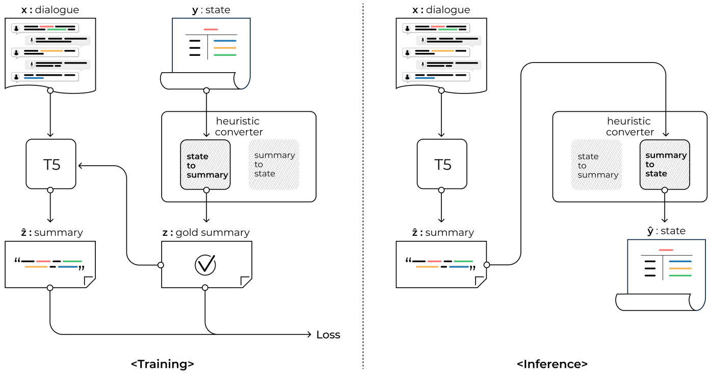

# Few-shot KLUE-DST as DS2
This is the Korean version implementation of "[Dialogue Summaries as Dialogue States (DS2), Template-Guided Summarization for Few-shot Dialogue State Tracking](https://arxiv.org/pdf/2203.01552.pdf)" on [KLUE-DST (a.k.a WoS)](https://github.com/KLUE-benchmark/KLUE) dataset.

## Overview
<p align="center">

</p>
I made the Korean heuristic converter myself, and it was relatively unnatural than English converter because of the difference in characteristics between Korean and English. Therefore, the model can make better performance if you make your own converter.

## Leaderboard
Few-shot JGA(%) is calculated with the validation set because the test set is not open to public.

<table>
  <tr>
    <td rowspan="2" align="center"> Model</td>
    <td colspan="15" align="center"> Domains</td>
  </tr>
  <tr>
    <td colspan="3" align="center"> 관광</td>
    <td colspan="3" align="center"> 식당</td>
    <td colspan="3" align="center"> 숙소</td>
    <td colspan="3" align="center"> 지하철</td>
    <td colspan="3" align="center"> 택시</td>
  </tr>
  <tr>
    <td rowspan="2" align="center"> Kolang-T5-base </td>
    <td align="center"> 1% </td>
    <td align="center"> 5% </td>
    <td align="center"> 10% </td>
    <td align="center"> 1% </td>
    <td align="center"> 5% </td>
    <td align="center"> 10% </td>
    <td align="center"> 1% </td>
    <td align="center"> 5% </td>
    <td align="center"> 10% </td>
    <td align="center"> 1% </td>
    <td align="center"> 5% </td>
    <td align="center"> 10% </td>
    <td align="center"> 1% </td>
    <td align="center"> 5% </td>
    <td align="center"> 10% </td>
  </tr>
  <tr>
    <td> 52.6 </td>
    <td> TBD </td>
    <td> TBD </td>
    <td> 38.7 </td>
    <td> TBD </td>
    <td> TBD </td>
    <td> 30.6 </td>
    <td> TBD </td>
    <td> TBD </td>
    <td> 81.6 </td>
    <td> TBD </td>
    <td> TBD </td>
    <td> 44.9 </td>
    <td> TBD </td>
    <td> TBD </td>
  </tr>
</table>

The pre-trained LM used in this repository is [Kolang-T5-base](https://github.com/seujung/kolang-t5-base).

## Installation
This repository is available in Ubuntu 20.04 LTS, and it is not tested in other OS.
```
conda create -n klue_dst python=3.7.10
conda activate klue_dst
cd KLUE_DST_as_DS2
pip install -r requirements.txt
```

## Download KLUE-DST Dataset
You can download the dataset from [KLUE-Benchmark](https://klue-benchmark.com/tasks/73/data/download) or the
following commands.

```
cd kluewos11
wget https://aistages-prod-server-public.s3.amazonaws.com/app/Competitions/000073/data/wos-v1.1.tar.gz
tar -xvf wos-v1.1.tar.gz
cd wos-v1.1/
mv ontology.json wos-v1.1_dev.json wos-v1.1_dev_sample_10.json wos-v1.1_train.json ..
cd ..
rm wos-v1.1.tar.gz
rm -r wos-v1.1
```

## Preprocess Data
It needs that converting the data format of KLUE-DST to that of MultiWOZ to utilize the original code for English. You can get `dev.json` and `train.json` after pre-processing in the `./kluewos11`.
```
cd ..
sh convert_data_format.sh
```

## Few-shot learning
Please set the training arguments `--dev_batch_size`, `--test_batch_size`, `--train_batch_size`, `--grad_acc_steps`, and `--num_gpus` in `train.sh` to suit your learning environment first, and then
```
sh train.sh
```
It takes approximately 5 minutes per epoch on 2 NVIDIA Titan RTX under for 1% of train set.
Finally, you can check the metrics from `metrics.csv` in `./log` if you follow the above commands.

## Citation and Contact
This repository is based on the following paper:
```bib
@article{shin2022dialogue,
  title={Dialogue Summaries as Dialogue States (DS2), Template-Guided Summarization for Few-shot Dialogue State Tracking},
  author={Shin, Jamin and Yu, Hangyeol and Moon, Hyeongdon and Madotto, Andrea and Park, Juneyoung},
  journal={arXiv preprint arXiv:2203.01552},
  year={2022}
}
```
